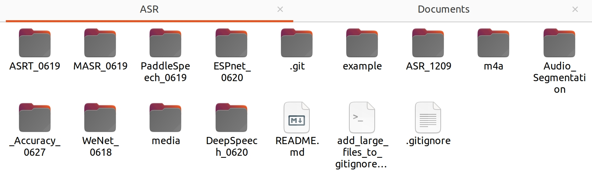

**Research (Development) Report for Shanghai Construction Group Inc.**

**Development of a Chinese Intelligent Voice Assistant Based on Open Source ASR, TTS, and Large Language Models**

* Taking the Shield Tunneling Machine Construction Scenario as an Example
* Supervisor: Hu Min

* Date: August 25, 2023


Table of Contents

[1. Research Background](#research-background)

[1.1 Existing and Realistic Research (Development) Background](#existing-and-realistic-research-development-background)

[1.2 Research (Development) Significance and Objectives](#research-development-significance-and-objectives)

[1.3 Program Design Overview](#program-design-overview)

[2. Testing and Technical Implementation of ASR and TTS Modules in Voice Assistant](#testing-and-technical-implementation-of-asr-and-tts-modules-in-voice-assistant)

[2.1 Preliminary Analysis of Deployment, Usage, and Characteristics of Open Source Chinese ASR and TTS Projects](#preliminary-analysis-of-deployment-usage-and-characteristics-of-open-source-chinese-asr-and-tts-projects)

[2.11 PaddleSpeech -- Supports ASR and TTS](#paddlespeech-supports-asr-and-tts)

[★ PaddleSpeech Deployment Process, Issues, and Related Documentation](#paddlespeech-deployment-process-issues-and-related-documentation)

[★ Analysis of PaddleSpeech Deployment & Usage Characteristics](#analysis-of-paddlespeech-deployment-usage-characteristics)

[2.12 MASR -- Supports Only ASR](#masr-supports-only-asr)

[★ MASR Deployment Process, Issues, and Related Documentation](#masr-deployment-process-issues-and-related-documentation)

[★ Analysis of MASR Deployment & Usage Characteristics](#analysis-of-masr-deployment-usage-characteristics)

[2.13 ASRT -- Supports Only ASR](#asrt-supports-only-asr)

[★ ASRT Deployment Process, Issues, and Related Documentation](#asrt-deployment-process-issues-and-related-documentation)

[2.14 ESPnet -- Supports ASR and TTS](#espnet-supports-asr-and-tts)

[★ ESPnet Deployment Process, Issues, and Related Documentation](#espnet-deployment-process-issues-and-related-documentation)

[★ Analysis of ESPnet Deployment & Usage Characteristics](#analysis-of-espnet-deployment-usage-characteristics)

[2.15 WeNet & DeepSpeech -- ASR](#wenet-deepspeech-asr)

[2.16 Other ASR and TTS Services](#other-asr-and-tts-services)

[2.2 Speed, Accuracy (Anti-Noise Performance) Testing of Available Open Source ASR Projects](#speed-accuracy-anti-noise-performance-testing-of-available-open-source-asr-projects)

[2.21 Open Source Corpus](#open-source-corpus)

[2.22 Audio to Text Processing](#audio-to-text-processing)

[2.23 Test Design - Principles & Metrics](#test-design-principles-metrics)

[2.24 Issues Encountered During Testing](#issues-encountered-during-testing)

[2.25 Brief Description of Test Program Design](#brief-description-of-test-program-design)

[2.26 Preliminary Test Results - 366 Voice Data](#preliminary-test-results-366-voice-data)

[2.3 Comprehensive Analysis and Conclusion](#comprehensive-analysis-and-conclusion)

[3. Technical Implementation of Intelligent Algorithm (AI) Module in Voice Assistant](#technical-implementation-of-intelligent-algorithm-ai-module-in-voice-assistant)

[3.1 Calling ChatGPT API, Main Issues, and Solutions](#calling-chatgpt-api-main-issues-and-solutions)

[3.2 Implementing Custom Training Set Based on Multi-Turn Dialogs with ChatGPT](#implementing-custom-training-set-based-on-multi-turn-dialogs-with-chatgpt)

[4. Integration of ASR&TTS and Intelligent Algorithms and Demo Launch](#integration-of-asrtts-and-intelligent-algorithms-and-demo-launch)

[4.1 Demo Environment and Module Integration](#demo-environment-and-module-integration)

[4.11 Recording User's Voice to Generate .wav File](#recording-users-voice-to-generate-wav-file)

[4.12 Using Selected ASR Model for Chinese Speech Recognition](#using-selected-asr-model-for-chinese-speech-recognition)

[4.13 Sending Recognition Results to ChatGPT Large Language Model for Response](#sending-recognition-results-to-chatgpt-large-language-model-for-response)

[4.14 Using Selected TTS Model for Text-to-Speech](#using-selected-tts-model-for-text-to-speech)

[4.2 Launching Chinese Voice Assistant Demo Based on PaddleSpeech and ChatGPT](#launching-chinese-voice-assistant-demo-based-on-paddlespeech-and-chatgpt)

[4.3 Demonstration of Accessing Intelligent Algorithm Module](#demonstration-of-accessing-intelligent-algorithm-module)

[5. Conclusion and Outlook](#conclusion-and-outlook)

[5.1 Deepening Research and Application of Speech Recognition, Conversion, and Noise Resistance](#deepening-research-and-application-of-speech-recognition-conversion-and-noise-resistance)

[5.2 Personalization and Commercialization for Specific Users and Scenarios](#personalization-and-commercialization-for-specific-users-and-scenarios)

[6. Appendix](#appendix)

# Research Background

In modern society, intelligent assistants, as an application of artificial intelligence technology, are gradually penetrating various fields, providing convenient services and information for people. With the continuous advancement of speech recognition and natural language processing technologies, AI Voice Assistants are playing an increasingly significant role in communication, information retrieval, and task execution.

This study aims to describe, evaluate, and test the development process of such Chinese voice assistants in the practical context of providing help information in the shield tunneling machine construction site. It records and assesses the feasibility of actual development and completes the corresponding demo's development and deployment.

## Existing and Realistic Research (Development) Background

In the commercial field of intelligent voice assistants, Deloitte Consulting's "2021 China Intelligent Voice Market Analysis Report"[^1] indicates that with the popularization of intelligent voice-driven intelligent driving, finance, operators, education, medical and other fields, professional-grade applications are enhancing, and its market share and prospects are increasingly growing. In future interaction, technology output, information synchronization, and search innovation fields, Chinese intelligent voice assistants have significant income growth potential.

In the academic field, many articles systematically elaborate on the technical implementation of voice assistants from the perspective of usage value and development. Related research includes a proposal by Subhash et al. in 2020[^2], stating that the voice control module, i.e., the ASR and TTS part, is an "important growth feature" of voice assistants, which is a direct manifestation of its change in people's lifestyles. It also proposes from a development perspective to output English audio using GTTS and play it with python's playsound, which is also adopted in this case. Another detailed description of such assistant development is the study focusing on Voice Control System published by Kim et al. in 2020[^3], which adopts a design idea of using third-party language models (using Google Assistant API as the intelligent algorithm part), adopted in this case. From a practical perspective, Faruk et al. also proposed in 2022[^4] that there is currently little usability research on voice assistants, and designed a usability measurement system adopting the ISO 9241-11 framework as a measurement tool, including a series of diverse independent variables for measuring usability. Many variables of this usability measurement scheme were adopted in this case.

## Research (Development) Significance and Objectives

Tunnel construction, as a complex and dangerous engineering field, requires timely and accurate information exchange and problem-solving. The development of intelligent assistants provides a more efficient and intelligent solution for tunnel construction work. Chinese speech recognition technology enables construction workers to no longer be limited to keyboard input but can quickly initiate queries and commands through voice. At the same time, the intelligent answering ability based on large language models makes the voice assistant interact with users more naturally and human-like.

The goal of this project is to complete the development of a Chinese voice assistant for the tunnel construction field, which can achieve functions such as speech recognition, natural language understanding, and voice response. This assistant can accurately recognize the user's voice commands in noisy environments and provide reasonable, basically accurate, more personalized, and natural responses based on the questions.

## Program Design Overview

The intelligent voice assistant includes five functional modules[^5], involving fields such as machine learning, network response, and computer audition. The five modules are encapsulated by audio_recording.py, recognize.py, chat_response.py, tts_executor.py, playsound.py, and executed by launch.py. The environment and log information are recorded by env_output.py, and the noise resistance ability of each ASR model is tested and evaluated by asr_noise_accuracy.py. The program flow is as follows:

# Testing and Technical Implementation of ASR and TTS Modules in Voice Assistant

Speech recognition and text-to-speech, namely Automatic Sound Recognition (ASR) and Text To Speech (TTS), are key technologies in intelligent assistant development. ASR uses automatic methods to recognize speech content, converting the on-site user's voice into text for input, while TTS converts the response text obtained by the voice assistant software through algorithms into sound, which is then delivered to the user as output. These technologies are typically based on machine learning, such as the gated convolutional neural network used by MASR or the gradient decision tree used by ASRT.

From the perspective of software development, this study will analyze current mature open-source Chinese ASR and TTS projects, conduct a series of tests, evaluate their performance, usability, and engineering, and determine the most suitable open-source project as the core technology for the described software implementation. This project should have features such as ease of use, suitability for server deployment, and strict open-source attributes.

## 2.1 Preliminary Analysis of Deployment, Usage, and Characteristics of Open Source Chinese ASR and TTS Projects

This study summarizes six open-source Chinese speech recognition and text-to-speech projects[^6], some supporting bidirectional technology, some supporting only one. The project homepage and documentation links are included in the report. The study believes that after successful environment configuration, the effects of each model are good, but its ease of use and difficulty of secondary processing (i.e., engineering) still need attention and analysis. Four of them have higher usability and become candidates for later development, they are PaddleSpeech, MASR, ASRT, ESPnet.

Based on their open-source documentation and other information, this study deploys and uses these models on Linux Ubuntu or Windows systems. During the deployment process, this study will preliminarily examine the usability of the following six open-source Chinese voice projects.

### PaddleSpeech -- Supports ASR and TTS

PaddleSpeech is an open-source model library based on PaddlePaddle, used for the development of various key tasks in speech and audio, containing a large number of influential models based on the forefront of deep learning. PaddleSpeech meets the open-source characteristics required by the shield intelligent assistant development project and has both ASR and TTS functions. In addition to this, PaddleSpeech has comprehensive and clear Chinese documentation, which makes the deployment and usage process relatively smooth, reflecting its ease of use.

- **PaddleSpeech Deployment Process, Issues, and Related Documentation:**

Official Documentation: [PaddleSpeech/README_cn.md at develop · PaddlePaddle/PaddleSpeech · GitHub](https://github.com/PaddlePaddle/PaddleSpeech/blob/develop/README_cn.md#%E5%AE%89%E8%A3%85)

Official Hardware & Environment Requirements: Python version 3.7 or above in Linux environment

Testing Environment: Linux Ubuntu 18.04 on VMware Virtual Machine - python3.10.6

```plaintext
> /home/chriswang/ASR/PaddleSpeech_0619/venv/bin/python
> /home/chriswang/ASR/PaddleSpeech_0619/env_output.py
> architecture: ('64bit', 'ELF')
> machine: x86_64
> node: chriswang-virtual-machine
> platform: Linux-5.15.0-56-generic-x86_64-with-glibc2.35
> processor: x86_64
> python_build: ('main', 'Nov 14 2022 16:10:14')
> python_compiler: GCC 11.3.0
> python_version: 3.10.6
> release: 5.15.0-56-generic
> system: Linux
> version: #62-Ubuntu SMP Tue Nov 22 19:54:14 UTC 2022
```

Environment Configuration Process: Configure the paddlepaddle environment according to the official documentation and install related dependencies.

Issues Encountered During Configuration (only issues related to the PaddleSpeech project itself):

- numpy version issue: During the local operation of the speech recognition function, an "np.complex depreciation" error is reported. The possible reason is that PaddleSpeech uses the numpy dependency, and the global numpy environment configured on the local Ubuntu system before is incompatible with the numpy version used in the PaddleSpeech project, and the configuration process by default did not install the compatible version of numpy in the virtual environment.

- Solution: Install a compatible version of numpy in the virtual environment.

```plaintext
> (venv)
> chriswang@chriswang-virtual-machine:~/ASR/PaddleSpeech_0619$ pip install numpy==1.21.6
```

- **Analysis of PaddleSpeech Deployment & Usage Characteristics:**

During both ASR and TTS processes, it is noted that the first run will enter the Setuptools Replacement process (this process is the project initialization in __init__.py). This process took about 20~30 seconds during local testing, and this process is used to generate cache for the pre-trained model.

In terms of accuracy, PaddleSpeech performs quite well.

a. ASR - the response speed is instant except for the first run, by calling the dependency function.

```python
from paddlespeech.cli.asr.infer import ASRExecutor
asr = ASRExecutor()
result = asr(audio_file="zh.wav")
```

b. TTS - Calling the dependency function is sufficient, supporting advanced voice mixing (both male and female voices are supported), adaptive punctuation pauses, and high accuracy.

```python
from paddlespeech.cli.tts.infer import TTSExecutor
tts = TTSExecutor()
tts(text="content", output="output.wav")
```

After testing PaddleSpeech, the biggest defect is still the configuration process issue of the first run. There is still no way to bypass the pre-loading of __init__.py for the first use. Compared with other speech processing projects mentioned later, PaddleSpeech is the only one that requires pre-loading. Although PaddleSpeech is developer-friendly, it does not support language model replacement[^7], meaning that parameters cannot be easily adjusted.

### MASR -- Supports Only ASR

MASR is an automatic speech recognition framework implemented based on Pytorch. MASR, short for Magical Automatic Speech Recognition, is dedicated to simple and practical speech recognition projects. It can be deployed on servers, Nvidia Jetson devices, and plans to support Android and other mobile devices in the future. MASR uses a Gated Convolutional Network, similar to the Wav2letter proposed by Facebook in 2016, a speech recognition system implemented using only Convolutional Neural Networks (CNN).

The feature of MASR is having a very robust and active open-source community. The Pytorch implementation of MASR is the result of the joint development of many developers in the community, using a single and simple technology, and supports custom language models.

- **MASR Deployment Process, Issues, and Related Documentation:**

Official Documentation: [masr: Chinese Speech Recognition, providing pre-trained models, high recognition rate Chinese Speech Recognition; Mandarin Automatic Speech Recognition; (gitee.com)](https://gitee.com/nanbowang/masr)

MASR Speech Recognition Algorithm Principle Analysis (non-official): [(73条消息) MASR Speech Recognition Algorithm Introduction_HELLOWORLD2424's Blog-CSDN Blog](https://blog.csdn.net/HELLOWORLD2424/article/details/123667877)

Comparison of MASR with other open-source ASR projects[^8]: [docs/compare.md · wangnanbo/masr - Gitee.com](https://gitee.com/nanbowang/masr/blob/master/docs/compare.md)

Official Hardware & Environment Requirements: Linux&Windows (no python version requirements mentioned in the official documentation)

Testing Environment[^9]: Linux Ubuntu 18.04 on VMware Virtual Machine - python3.6

Environment Configuration Process: Configure the environment according to the official documentation and the built-in readme.md instruction file in the project. Because the project uses pytorch dependency, the latest version of python is incompatible with it; at the same time, the model supports and only supports custom model training, that is, no pre-trained language models, developers need to choose language model training on their own, which leads to a higher complexity of environment configuration. For this reason, the author also provides a docker version (packaged environment version). However, for familiarizing with the project, the environment was attempted to be reconfigured, and it was basically able to run successfully.

Issues Encountered During Configuration (only issues related to the MASR project itself):

- python version issue: MASR is incompatible with common python versions. Since the official documentation does not mention clear python version requirements, an error occurs when trying to install the torch dependency with python3.10. This is because the MASR project version tested in this paper is a Pytorch version redesigned based on the principle of MASR, and the original version did not use the torch dependency (the original author has stopped updating), so the document did not point out that a higher python version would cause problems (pytorch currently does not support releases newer than python3.7.9, regarding pytorch compatible version information: [https://stackoverflow.com/a/58902298/5090928](https://stackoverflow.com/a/58902298/5090928)).

- Solution: Run python3.6 in a virtual environment and install the corresponding compatible version of pytorch

- **Analysis of MASR Deployment & Usage Characteristics:**

Usage Method: Just call the convolution function for training and prediction.

```python
import _init_path
from models.conv import GatedConv
model = GatedConv.load("pretrained/gated-conv.pth")
text = model.predict("test.wav")
```

The console executes the demo in a virtual environment.

```plaintext
> (venv) chriswang@chriswang-virtual-machine:~/ASR/MASR_0619$ python3 examples/demo-recognize.py
```

MASR's deployment documentation is comprehensive, with minimal deployment obstacles. Additionally, in terms of secondary development potential, the official website offers 6 preset Chinese language models that can be replaced or use a custom training set. This project does not require pre-loading on first run. MASR also supports real-time recording response and provides comprehensive server deployment documentation.

### ASRT -- Supports Only ASR

The ASRT project is a Chinese speech recognition system based on deep learning, using a speech model built with TensorFlow.Keras based on deep convolutional neural networks and CTC. Notably, this system also comes with an HTTP-based server software, making it relatively convenient to set up an API server for other clients to send API requests.

- **ASRT Deployment Process, Issues, and Related Documentation:**

GitHub Project Address: [https://github.com/nl8590687/ASRT_SpeechRecognition](https://github.com/nl8590687/ASRT_SpeechRecognition)

Speech Recognition Client Applications Based on ASRT:

- Windows Desktop Version: [https://github.com/nl8590687/ASRT_SpeechClient_WPF](https://github.com/nl8590687/ASRT_SpeechClient_WPF)

- Windows 10 UWP Version: [https://github.com/nl8590687/ASRT_SpeechClient_UWP](https://github.com/nl8590687/ASRT_SpeechClient_UWP)

ASRT Project Official Website (maintained by the author personally): [ASRT: Auto Speech Recognition Tool \| AI柠檬 (ailemon.net)](https://asrt.ailemon.net/)

Author's Personal Zhihu Column Introduction to ASRT: [ASRT: A Chinese Speech Recognition System - Zhihu (zhihu.com)](https://zhuanlan.zhihu.com/p/44055562)

Official Hardware & Environment Requirements: Linux: Ubuntu 18.04 + / CentOS 7 + or Windows 10/11

Python: 3.7 - 3.10 and later versions TensorFlow: 2.5 - 2.11 and later versions

Testing Environment: Linux Ubuntu 18.04 on VMware Virtual Machine - python3.10

Environment Configuration Process: Configure according to the documentation on the Github homepage.

Issues Encountered During Configuration:

- Flask Architecture & Network & Documentation Issues: The project adopts a Flask architecture of client + server, and many issues were encountered during environment configuration. Additionally, during client usage, API calls need to be made online, and many dependencies (such as tensorflow and training datasets) files are large, causing multiple disconnections. In terms of project documentation, many links provided by the author point to websites that are not maintained (Forbidden 403), causing obstacles.

- Solution: Unable to completely resolve, but through the use of proxies, using images provided by the author, and referring to CSDN developer articles to obtain necessary dependency information, a demo was successfully run.

- Report tensorflow deprecated error: It is said to be a tensorflow version issue, and the correct tensorflow version was not installed. Currently, there is no feasible solution.

```plaintext
> decay is deprecated in the new Keras optimizer, please check the docstring for valid arguments, or use the legacy optimizer, e.g., tf.keras.optimizers.legacy.Adam.
```

### ESPnet -- Supports ASR and TTS

ESPnet is an end-to-end speech processing toolkit, covering fields such as end-to-end speech recognition, text-to-speech, speech translation, speech enhancement, speaker segmentation, and spoken language understanding. ESPnet uses PyTorch as its deep learning engine and follows the Kaldi-style data processing and feature extraction format.

- **ESPnet Deployment Process, Issues, and Related Documentation:**

Official Documentation: [Usage --- ESPnet 202304 documentation](https://espnet.github.io/espnet/tutorial.html)

Github Project Address: [GitHub - espnet/espnet: End-to-End Speech Processing Toolkit](https://github.com/espnet/espnet)

Official Hardware & Environment Requirements: Linux: Ubuntu / CentOS 7 / debian 11 & Python: 3.7 - 3.10 and later versions & No Windows support

Testing Environment: Linux Ubuntu 18.04 on VMware Virtual Machine - python3.10

Environment Configuration Process: Configure according to the documentation on the Github homepage and official documentation. It should be noted that directly calling the function will automatically download the training set, using python download command is very slow. You need to find an available Chinese speech training set and place it under this path:

...\\site-packages\\espnet_model_zoo\\a1dd2b872b48358daa6e136d4a5ab08b

- **Analysis of ESPnet Deployment & Usage Characteristics:**

Based on preliminary judgment, ESPnet has the most comprehensive functional interfaces among all the mentioned projects. No major obstacles were encountered during the deployment process. Although further testing is needed, intuitively, ESPnet's ASR accuracy is very high, and its speed is very fast, allowing for instant conversion. Another significant advantage is that its provided language models and project files are the smallest among all the Chinese speech recognition projects compared, which is conducive to server deployment. No major obstacles were encountered during the environment configuration process, and usability is good.

a. ASR - Can be implemented by calling the soundfile library and preset functions

```python
audio, rate = soundfile.read("zh.wav")
nbests = speech2text(audio)
text, *_ = nbests[0]
```

b. TTS - Official Documentation Location:

[CMU 11492/11692 Spring 2023: Text to Speech --- ESPnet 202304 documentation](https://espnet.github.io/espnet/notebook/TextToSpeech_CMU_11492_692_Spring2023(Assignment8).html)

Although ESPnet supports Text to Sound, its Chinese standard female voice library calls the [data-baker] "Chinese Standard Female Voice Library", which, although claimed to be open source, does not support commercial use, see:

Data Baker Open Source Corpus Website: [https://www.data-baker.com/open_source.html](https://www.data-baker.com/open_source.html)

Based on this reason, this case no longer considers its TTS function as a candidate for subsequent development.

### WeNet & DeepSpeech -- ASR

Environment Configuration Issue: Encountered system not supported error, suspected that WeNet (tested on both Windows and Linux Ubuntu) and DeepSpeech (tested on Linux Ubuntu) python distribution library does not support Ubuntu 20.04 system, nor does it support Windows11 system, or there may be other reasons, currently unresolved.

### Other[^10] ASR and TTS Services

Alibaba Cloud ASR and Tencent Cloud ASR: Tencent Cloud provides "free + paid" Chinese automatic speech recognition services: [Function Experience - Speech Recognition - Console (tencent.com)](https://console.cloud.tencent.com/asr/demonstrate) Tencent Cloud has been tested, somewhat laggy, basically accurate; a feature is that it can choose audio categories, i.e., phone and non-phone. Another advantage is that it supports dialect recognition, including Cantonese and Shanghainese.

Microsoft Azure (TTS): Provides free API interface, the drawback is that registration is required at this stage, qualification application, and payment verification: [Microsoft Azure------Text-to-Speech (TTS) REST API Usage Tutorial - Zhihu (zhihu.com)](https://zhuanlan.zhihu.com/p/627165015#:~:text=%E5%BE%AE%E8%BD%AF%20Microsoft%20Azure%E2%80%94%E2%80%94%E6%96%87%E6%9C%AC%E8%BD%AC%E8%AF%AD%E9%9F%B3%20%28TTS%29%20REST%20API%20%E4%BD%BF%E7%94%A8%E6%95%99%E7%A8%8B%201,%E6%96%87%E6%9C%AC%E8%BD%AC%E8%AF%AD%E9%9F%B3%E5%BF%AB%E9%80%9F%E5%85%A5%E9%97%A8%20-%20%E8%AF%AD%E9%9F%B3%E6%9C%8D%E5%8A%A1%20-%20Azure%20Cognitive%20Services%20) & [Text-to-Speech -- Realistic AI Voice Generator \| Microsoft Azure](https://azure.microsoft.com/zh-cn/products/cognitive-services/text-to-speech/)

## 2.2 Speed, Accuracy (Anti-Noise Performance) Testing of Available Open Source ASR Projects

Conduct comprehensive tests of speed, accuracy, and noise resistance of available projects from 2.1. The test design is based on an open-source Chinese audio corpus database (i.e., a database containing audio files and their corresponding correct content text), conducting result comparison tests. In terms of accuracy, the test design indicators are mainly CER (Character Error Rate), WER (Word Error Rate), MER (Missed Error Rate), and MIL (Message-Intent-List Error), see 2.23 Test Design -- Principles & Metrics. In terms of speed, use average processing time, and character-average processing time. This study selected a dataset covering noise for testing, which can to some extent examine its noise resistance performance.

### Open Source Corpus

Several of the latest free open-source Chinese speech datasets: [https://blog.ailemon.net/2018/11/21/free-open-source-chinese-speech-datasets/](https://blog.ailemon.net/2018/11/21/free-open-source-chinese-speech-datasets/)

Aishell Corpus OpenSLR: [http://www.openslr.org/33/](http://www.openslr.org/33/)

Aishell is an open-source Mandarin Chinese speech corpus released by Beijing Puzhisheng Technology Co., Ltd. The corpus invited 400 people from different accent regions in China to participate in recording, through professional speech annotation and rigorous quality checks, with a manual transcription accuracy rate of over 95%. These data are available for free for academic research.

> The feature of this Chinese corpus is that it covers multiple scenarios, such as commercial office, industrial production, etc. Its advantage is that the accuracy rate of the text corresponding files it provides is relatively high. In addition, its corpus range covers audio with noise, which can to some extent simulate the noise environment of shield machine tunnel operations. The disadvantage is that it lacks quantification of parameters such as noise level, which to some extent reduces the credibility of the conclusions of the noise resistance performance test in this study.

### Audio to Text Processing

Perform NLP on the text files corresponding to the audio, including normalization, i.e., using re to delete pauses, spaces, etc., in the script file, see appendix for specific process:

```python
...
match = re.search(r'(BAC\S+)\s+([\u4e00-\u9fa5])', line)
```

The purpose of this process is to preprocess the text files corresponding to the audio database. This includes simple format adjustments and data denoising for subsequent comparison tests.

### Test Design - Principles & Metrics

> ASR Effect Evaluation Principles and Practices: [AI Popular Science Article \| Is Speech Recognition Accurate](https://zhuanlan.zhihu.com/p/596488859)
>
> ASR (Automatic Speech Recognition) Speech Recognition Test Test Process: [ASR (Automatic Speech Recognition) Speech Recognition Test Test Process - Northward. - Blog Park (cnblogs.com)](https://www.cnblogs.com/yfacesclub/p/13874778.html)
>
> Test Tool Library: [Python - Speech Recognition Text Similarity Measurement Library Jiwer, Can Calculate Word Error Rate WER, Match Error Rate MER, etc. Similarity Measurement Indicators - StubbornHuang Blog](https://www.stubbornhuang.com/2174/)
>
> WER (Word Error Rate): WER is the abbreviation for word error rate, an important indicator for evaluating ASR effects. It is used to measure the error rate between predicted text and labeled text, specifically, it is used to measure the word-level error rate in recognition results. It calculates the ratio of the number of wrongly recognized words to the total number of words. A lower WER value indicates higher word-level recognition accuracy of the system.
>
> 
>
> (Deletions: Number of characters deleted in error, Insertions: Number of characters inserted in error, Substitutions: Number of characters substituted in error, ReferenceWords: Total number of characters)
>
> It should be specifically noted that WER (Word Error Rate) is often used to test English text[^12]. This is because the smallest unit in alphabetic language sentences is a word (Word), while the smallest unit in Chinese is a character (Character). Therefore, in Chinese speech recognition tasks, character error rate (Character Error Rate, CER) is used to measure ASR recognition effects. The calculation method of both is the same, but the variable units are different. In the Chinese field, WER is sometimes used to represent this indicator, but it is essentially CER.
>
> MER (Missed Error Rate): MER is used to measure the proportion of speech segments that the system failed to recognize correctly, i.e., missed errors. A lower MER value indicates the system more accurately recognizes speech segments.
>
> WIL (Word Information Loss): Used to evaluate the amount of information lost by the system when converting speech input to text output. It measures the degree of information loss of the system during recognition. The lower the WIL, the closer the recognition result is to the original speech input, with less information loss, and better recognition effect; the higher the WIL, the more information loss, and poorer recognition effect.
>
> MIL (Message-Intent-List Error): MIL is the abbreviation for message-intent-list error, used to evaluate the system's accuracy in recognizing a user's intent and generating the correct response in applications such as voice assistants. It involves the matching accuracy between messages (user input), intents (user intent), and lists (possible response lists). Although testing for this indicator is not within the scope of this report, MIL is likely to provide an effective indicator for future research.

### Issues Encountered During Testing

- PaddleSpeech: Memory overflow error. The issue is that if PaddleSpeech doesn't have enough memory during training, it will directly perform a kill process, meaning this error has no direct error message or error log available.

- Solution: Add memory at the hardware level. Due to the code design of the PaddleSpeech project itself, its training has high hardware requirements. When 4G memory was allocated to the virtual machine, PaddleSpeech only successfully recognized the first 5 entries of the corpus; with 8G memory, it recognized 21 entries; with 16G memory, it recognized about the first 100 entries. Currently, there is no method to completely resolve this issue from a software level.

### Brief Description of Test Program Design[^13]

Use Python's third-party speech recognition testing library jiwer to test each ASR model. This library comes with functions for calculating the above indicators.

Below is part of the code and comments[^14]:

```python
# Traverse each speech sample for testing
for audio_path, reference in zip(test_audio, reference_text):
    counter += 1
    start_time = time.time()  # Record start time
    transcription = recognize_speech(audio_path)  # Recognize speech
    processing_time = time.time() - start_time  # Calculate processing time

    try:
        error_rate = cer(reference, transcription)  # Calculate word error rate (Word Error Rate)
    except ValueError:
        error_rate = 0

    tpc = processing_time / len(transcription)  # Calculate average processing time per character
```

With the jiwer library, accuracy tests can be performed relatively easily. The recognized text (Transcription) obtained by the model is compared with the given default correct corresponding text (Reference).

### Preliminary Test Results - 366 Voice Data

Due to the research volume and hardware limitations, tests were conducted for the ASR of the MASR, ESPnet, PaddleSpeech three projects, with a test set of 366 entries. The results are as follows:

| Model     | CER          | MER  | WIL  | Processing Time | Character Average Processing Time |
|-----------|--------------|------|------|-----------------|-----------------------------------|
| MASR      | 0.1071131136 | 0.61 | 0.61 | 0.311923899     | 0.026327601                       |
| ESP_Net   | ≈ 0.004      | 0.003|      | 5.517344459     | 0.440989218                       |
| PaddleSpeech| 0.023133293| 0.222| 0.22 | 6.347445911     | 0.618048923                       |

(Time unit: seconds)

## 2.3 Comprehensive Analysis and Conclusion

From the preliminary deployment results in 2.1, it can be concluded that among the six Chinese open-source ASR and TTS projects, WeNet and DeepSpeech failed to successfully run on Linux systems, which means poor server deployment feasibility. Even if adopted, it may cause a burden on later maintenance. The ASRT project files are relatively bloated, making it unsuitable for server deployment, and it also has the same ease of use issues. Although MASR processing speed is extremely fast, its processing accuracy is significantly lower compared to ESPNet and PaddleSpeech, with CER reaching about 0.1. ESPNet has moderate speed, extremely high accuracy, with CER reaching 0.004, but the drawback is that it does not have both ASR and TTS functions[^16]. This means that if only its ASR function is adopted, it would increase the work of integrating a TTS project into the final product software, which often means environment conflicts and larger project size. PaddleSpeech, while ensuring accuracy, speed, and project completeness, guarantees open-source attributes.

Therefore, based on the current information, the conclusion is drawn to adopt PaddleSpeech as the core technology for implementing the ASR and TTS modules of the intelligent voice assistant[^17].

# Technical Implementation of Intelligent Algorithm (AI) Module in Voice Assistant

The intelligent algorithm of the voice assistant converts the user's input into output. The implementation of this process depends on the specific scenario. In the shield tunneling machine construction scenario designed in this report, two implementation approaches are envisaged.

One is to generate responses through artificial design of text decision data. Its data structure can be a decision tree or a two-dimensional table. Specifically, the algorithm extracts keywords from the user's input text and generates a prepared set of responses accordingly. Its feature is high accuracy, which may be suitable for answering intelligent software that requires extremely rigorous responses. The main premise of this implementation is a sound database of on-site questions and corresponding response texts, and from a technical standpoint, this topic does not delve deeply.

The other is based on the currently popular large language model, i.e., training the on-site questions and responses data with a language model. In this process, the large language model acts as a classifier, and it also has at least two advantages:

a. The ability to "personalize" and "naturalize" the response text language to a certain extent: The large language model has an excellent ability to "polish" wording. Simply assembling responses based on the database from the prepared responses, the text output is relatively "mechanical," with poor readability and affinity in expression.

b. Error correction for input text: Taking OpenAI's ChatGPT as an example, even if the input Chinese grammar is not smooth, has typos, or omitted words, it does not significantly affect ChatGPT's correct return. This just happens to make up for potential text recognition errors in the ASR stage due to noise or homophones, polyphones, etc.

## 3.1 Calling ChatGPT API, Main Issues, and Solutions

In the voice assistant, using a large language model can be achieved by calling the ChatGPT API. API (Application Programming Interface) serves as an interface that allows different applications to communicate, achieving dialogue by sending requests to the OpenAI server through the local server and obtaining responses.

```python
...
response = openai.Completion.create(
    engine="text-davinci-003",  # Select the model engine
    prompt=user_input,
    max_tokens=50  # Control the length of the generated response
)
# Extract the generated response
generated_answer = response.choices[0].text.strip()
```

Obviously, this implementation has two main issues:

a. Network issue: OpenAI's API does not support access from mainland China. There are three solutions:

- Deploy the API module on a server located abroad: By deploying this part of the code on a server located in Asia abroad, it can have low latency and bypass the problem of access being denied from domestic IP. It has been tested that access through a Tencent Cloud-based server deployed in Tokyo has excellent response speed. By using nc or ssh technology to connect servers located domestically and those in Tokyo, the transmission speed is also predictably within an acceptable range. In other words, this is a feasible solution after testing.

- Use proxy technology: Mainstream server open-source proxy technology includes squid, etc. This report does not delve into it. In the final demo, this approach is adopted.

- Deploy a similar large language model locally: On open-source platforms like Github, you can find projects that deploy large language models like ChatGPT locally. However, there are two significant issues with this: first, it is not clear whether this complies with the rules of the large language model developers and suppliers, and second, these projects are very large, requiring high computing power from the server, encountering difficulties in deployment and operation.

b. Uncontrollable response speed and accuracy:

> Due to the use of third-party non-open-source technology, whether a return can be successfully obtained also depends on uncontrollable factors such as whether the OpenAI server is providing services normally. Additionally, the model's return may contain non-compliant, inappropriate, or inaccurate content. To a certain extent, it can be mitigated by informing users that the content is generated with the involvement of third-party artificial intelligence algorithms, which also prevents users from over-relying on the responses given by the software.

## 3.2 Implementing Custom Training Set Based on Multi-Turn Dialogs with ChatGPT

In practical applications, the interaction between users and voice assistants is often multi-turn. To make the voice assistant perform better in such situations, this example constructs a custom training set to fine-tune the model. This means that a series of dialogues related to shield tunneling, including user questions and system responses, are still needed------but it does not have to be a strict decision tree structure, i.e., containing strictly corresponding question texts and response texts. It only needs to be declarative knowledge content. This is because, through multi-turn dialogue training, the model can learn to handle context information and respond to complex user queries.

...

> pretrained_data =
> "Respond with information related to shield machines, no more than 30 Chinese characters, no more than 2 sentences"
> messages = [{"role": "user", "content": ""}]
> str_in = "【User's input voice, e.g., How to deal with the situation of the yellow signal light flashing?】"
>
> for text in [pretrained_data, str_in]:
>     messages.append({"role": "user", "content": text})
>     generated_answer = askChatGPT(messages)

It should be noted that the content in pretrained_data above is just a simple example. In practice, what will be written here is a large amount of prepared data, i.e., dialogues related to shield tunneling, including user questions and system responses.

# Integration of ASR&TTS and Intelligent Algorithms and Demo Launch

## 4.1 Demo Environment and Module Integration

Integrate various modules in a unified environment, taking into account encapsulation, running efficiency, deployability, and other characteristics to complete the development of the demo. This demo uses PaddleSpeech as the core of ASR and TTS modules and calls the ChatGPT API from the OpenAI server to obtain result responses. This demo can run on a local Linux system set up with a proxy. Since it fully uses cross-platform technology, it should also be able to run on other operating systems.

The problem with this version of the demo is that, intuitively speaking, it is not smooth enough in terms of response speed and user interaction. Additionally, it can only be run locally through forwarding proxy on an overseas server. To address this issue, another networked version based on HTTP is designed in this project (see section 4.2 Launch), where the ChatGPT functional module is deployed on an overseas server, and it can run on any device capable of obtaining HTTP responses.

### Recording User's Voice to Generate .wav File

This can be implemented using the pyaudio and wave libraries:

...

```python
stream = p.open(format=FORMAT,
                channels=CHANNELS,
                rate=RATE,
                input=True,
                frames_per_buffer=CHUNK)  # Create a recording file
```

Adjustable parameters include recording time, format, sound frequency, and size, etc.

```python
audio_recording.start_audio(5, "zh.wav")
```

### Using Selected ASR Model for Chinese Speech Recognition

In this example, the PaddleSpeech model is used for ASR recognition:

...

```python
asr = ASRExecutor()
return asr(audio_file=audio)
```

In launch.py, call the recognize function in recognize.py.

```python
str_in = recognize.recognize("zh.wav")
```

### Sending Recognition Results to ChatGPT Large Language Model for Response

See section 3.2 for multi-turn dialogue implementation of pre-trained data set.

```python
response = chat_response.multi_response(str_in)
```

### Using Selected TTS Model for Text-to-Speech

In this example, PaddleSpeech's default female voice is used: see section 2.11.b

```python
tts_executor.tts_execute(response)
```

And play it using the playsound function from the playsound library.

```python
playsound("output.wav")
```

## 4.2 Launching Chinese Voice Assistant Demo Based on PaddleSpeech and ChatGPT

In the software launch operation of this example, Django and Nginx architecture[^22] are mainly used. In this example, the entire project is not launched to the server, but the intelligent algorithm logic module involving ChatGPT is launched to the server, and the ASR and TTS modules of PaddleSpeech are deployed locally. The reason is partly due to the project volume and partly because ASR technology based on machine learning exceeds the computing load of available servers, separate deployment also reflects engineering. Due to topic limitations, this part is not discussed in depth, below is part of the code[^23]:

```python
def send_request_to_django():
    # Django server URL
    django_url = "http://124.222.120.214/ai_voice_assistant_handle/hi"

    try:
        # Send GET request to Django server
        response = requests.get(django_url)

        # Check response status code
        print(response.status_code)
        if response.status_code == 200:
            # Get returned text data
            response_text = response.text
            return response_text
        else:
            print(f"Request failed with status code: {response.status_code}")
    except requests.exceptions.RequestException as e:
        print(f"Request error: {e}")
```

## 4.3 Demonstration of Accessing Intelligent Algorithm Module

You can test the current version of the demo by accessing it with a browser. During server maintenance, access [http://124.222.120.214/ai_voice_assistant_handle/](http://124.222.120.214/ai_voice_assistant_handle/) and add a question at the end. Wait for 30~60 seconds. Since proxy technology is used on the server side, no special network settings are required to access. The model has undergone some shield machine related training, including:

- User questions related to shield machines and tunnels
- Considering dialogue coherence, the returned content should not be too long
- Try to return similar answers for the same question (random parameters are set to relatively fixed values)

Below are some question and answer examples:

- [124.222.120.214/ai_voice_assistant_handle/What can you help me with](http://124.222.120.214/ai_voice_assistant_handle/%E4%BD%A0%E5%8F%AF%E4%BB%A5%E5%B8%AE%E5%88%B0%E6%88%91%E4%BB%80%E4%B9%88)

Response: I can provide help related to the basic knowledge, working principles, and application fields of shield machines. If you have specific questions, I will also do my best to answer them for you.

- [124.222.120.214/ai_voice_assistant_handle/Safety precautions for shield machine tunnel operations](http://124.222.120.214/ai_voice_assistant_handle/%E7%9B%BE%E6%9E%84%E6%9C%BA%E9%9A%A7%E9%81%93%E4%BD%9C%E4%B8%9A%E7%9A%84%E5%AE%89%E5%85%A8%E6%B3%A8%E6%84%8F%E4%BA%8B%E9%A1%B9)

Response: Eliminate geological risks, strictly follow operating procedures, ensure ventilation and rescue measures, and guarantee the safety of personnel and equipment.

- [124.222.120.214/ai_voice_assistant_handle/Who invented the shield machine](http://124.222.120.214/ai_voice_assistant_handle/%E7%9B%BE%E6%9E%84%E6%9C%BA%E6%98%AF%E8%B0%81%E5%8F%91%E6%98%8E%E7%9A%84)

Response: The shield machine was invented by Japanese engineer Seiji Nakamura in 1963.

# Conclusion and Outlook

This project integrates speech recognition, text generation, and text-to-speech technologies to achieve a basic voice interaction system. In conclusion, the research preliminarily proves the feasibility of developing a Chinese voice assistant and provides related materials and their sources for similar projects or subsequent development of this example. This paper focuses on testing multiple mainstream open-source ASR and TTS projects and analyzes their advantages and disadvantages in various indicators. The paper suggests design ideas and technical choices for developing such assistants and implements a demonstration of basic functions, providing some basis for the development and research of similar projects in the future.

As an extension and outlook, this system still has the following potentials in the future.

Although PaddleSpeech is used as the speech recognition and text-to-speech model in this project, with the continuous development of deep learning and artificial intelligence fields, future speech technology still has great research and application potential. In the field of noise resistance for specific scenes, this case is also involved but shallowly. Exploring higher accuracy ASR models, more natural and smooth TTS models, and better handling of multilingual and accent technologies, are directions to further enhance the performance of voice interaction systems. Among them, the recognition of dialects and industry terms is particularly valuable for innovation.

The focus of this study is on the back-end technical implementation of voice assistants, but sound application software often requires excellent user-side design to improve interactivity. This includes user-customized UI interfaces and user interaction design aimed at scenarios, which also facilitates the commercialization of technology.

# Appendix

Hello, teachers, this is the appendix of the 2020 Wang Xinzhu's summer professional internship.

This text is used to point out the content structure of the files I submitted and my personal understanding of them.

---

★ The files contained in this folder are not executable, they do not have an execution environment. All the files included in this file are independent, they are representative programs selected from multiple projects including 6 voice engineering projects, testing projects, and online demos (based on nginx's django project). They do not depend on each other. They are for code demonstration purposes only.

★ During the defense process, I will prepare the environment of all the processes mentioned in the report in the background for demonstration. This also includes the execution of all the codes mentioned in this file.

---

Professional Internship Report-20124444-Wang Xinzhu.docx - is the report of my research subject during the professional internship. Since this subject has clear development goals, it is also similar to a development report.

asr_noise_accuracy_test.py - the program used for testing the accuracy (various indicators) of Chinese speech recognition projects.

audio_recording.py - the main program of the user recording module.

chat_response.py - the main program of the intelligent response algorithm module. Send requests to OpenAI and receive returns. This part is actually deployed on the server.

env_output.py - Since software development is carried out on at least 3 platforms (Linux Ubuntu virtual machine, Windows host, Tencent Cloud proxy Linux ubuntu remote server), this script can be used to output the operating environment as a record, for easy troubleshooting of environment-related errors.

launch.py - the file where the main function is located.

recognize.py - shows the calling of ASR module functions. Here, the API of PaddleSpeech is selected for demonstration. However, in the test, due to 6 ASR projects to be tested, this module has 6 different versions.

tts_executor.py - shows the calling of TTS module functions. For the same reason, the files of each project are different.

request.py - the program for sending requests to the server to obtain OpenAI requests locally.

espnet, masr, paddlespeech_noise_test.csv - partial test results of 3 ASR projects.

nlp_transcript.py - a program for preprocessing aishell_transcript datasets

nlp_processed_transcript.txt - preprocessed aishell dataset

aishell_transcript_v0.8.txt - original aishell dataset

---

★ About the demo:

I have created 3 versions of the finished product for display and download.

1. **(Recommended: Does not include ASR and TTS functions)** Only access the AI of the intelligent assistant (the model has undergone some shield machine-related training):

Access directly using the URL format "http://124.222.120.214/ai_voice_assistant_handle/" + "Your input" with a browser.

For example: "124.222.120.214/ai_voice_assistant_handle/What can you help me with".

You can get the response within about 30-60 seconds (the browser page will render the response), the time depends on the network situation on the server side. This IP is maintained for a long time.

2. **(Includes full functionality) Linux Ubuntu local version:**

It includes full software functionality, including using the microphone as input, access AI, and voice output. Although it has not been tested on other platforms, theoretically, it comes with a packaged virtual environment, and on the linux system, using "source venv/bin/activitate" to activate the virtual environment, using "python3 launch.py" to run the program on the console. On the Windows system, activate the virtual program using activate.sh, and use "python launch.py" to run. The inconvenience is that this version does not go through the proxy server but directly sends requests to OpenAI locally. This requires your device to run a global proxy or modify the relevant proxy-related code in the OpenAI package.

Since this version is relatively large, you can download it through the link below, or directly ask me for it on WeChat.

[http://124.222.120.214/download/PaddleSpeech_0619](http://124.222.120.214/download/PaddleSpeech_0619)

3. **(Includes full functionality) Windows local version:**

This version includes full functionality. Unlike the Linux version, it sends requests to OpenAI via my cloud server, which runs a proxy itself. It is worth noting that the overseas server I originally rented has just expired recently, which led to this "proxy + proxy" complex scheme. Due to unfamiliarity with the Windows development environment, there are still some unknown issues with this version. If you are interested, you can ask me for it on WeChat.

---

★ For parts such as nginx and django that are not displayed due to the topic, please refer to my personal blog:

Django: [http://124.222.120.214/media/notion_files/080823/0808/Django_Basics.html](http://124.222.120.214/media/notion_files/080823/0808/Django_Basics.html)

nginx related: [http://124.222.120.214/media/notion_files/070923/Nginx%20Access%20Log%20Generator%20ac0ae7cc599a40f09d36f4031e6e9063.html](http://124.222.120.214/media/notion_files/070923/Nginx%20Access%20Log%20Generator%20ac0ae7cc599a40f09d36f4031e6e9063.html)

[^1]: Deloitte "The Future of Voice World: China Intelligent Voice Market Analysis", December 2021, [The Future of Voice World------China Intelligent Voice Market Analysis \| Deloitte China \| Technology, Media, and Telecommunications Industry (deloitte.com)](https://www2.deloitte.com/cn/zh/pages/technology-media-and-telecommunications/articles/analysis-china-intelligent-voice-market.html)

[^2]: S Subhash, Prajwal N Srivatsa, S Siddesh, A Ullas, B Santhosh. "Artificial Intelligence-based Voice Assistant." IEEE. 29 Cites in Papers, 2912 Full Text Views, [Artificial Intelligence-based Voice Assistant \| IEEE Conference Publication \| IEEE Xplore](https://ieeexplore.ieee.org/document/9210344)

[^3]: Tae-Kook Kim. "Short Research on Voice Control System Based on Artificial Intelligence Assistant." IEEE. Published in 2020 International Conference on Electronics, Information, and Communication (ICEIC). Cites: 12, Full Text Views: 765, [Short Research on Voice Control System Based on Artificial Intelligence Assistant \| IEEE Conference Publication \| IEEE Xplore](https://ieeexplore.ieee.org/document/9051160)

[^4]: Faruk Lawal Ibrahim Dutsinma, Debajyoti Pal, Suree Funilkul, Jonathan H. Chan. "A Systematic Review of Voice Assistant Usability: An ISO 9241--11 Approach." SN Computer Science, volume 3, Article number: 267 (2022). Published on 03 May 2022, [A Systematic Review of Voice Assistant Usability: An ISO 9241--11 Approach \| SpringerLink](https://link.springer.com/article/10.1007/s42979-022-01172-3)

[^5]: For details of the module encapsulation, see readme.txt

[^6]: They are PaddleSpeech, MASR, ASRT, ESPnet, WeNet, and DeepSpeech

[^7]: Because PaddleSpeech is already a secondary project developed based on the Python machine learning library PaddlePaddle by the PaddlePaddle team, it can only be adapted to the speech corpus models that PaddlePaddle comes with

[^8]: Analysis and comparison summarized by the creator of the MASR Chinese community, mainly comparing with ASRT, also mentioning DeepSpeech

[^9]: The MASR testing environment is consistent with PaddleSpeech except for the Python version

[^10]: Non-open source or cannot be deployed locally

[^11]: For detailed code process, see appendix nlp_transcript.py

[^12]: Including languages such as English with word (word) as the smallest semantic unit. These languages are called "morpheme languages" (Agglutinative Language), usually by adding affixes to the stem to indicate different grammatical and semantic relationships. Suitable for using WER for corresponding accuracy evaluation; conversely, languages using characters (character) as the smallest unit are called "phoneme languages" (Alphabetic Language). These languages use letters (phonemes) as the basic units to construct words, each letter representing a specific speech phoneme, such as Chinese. Suitable for using CER for accuracy evaluation

[^13]: For some comparison test result samples, see appendix espnet, masr, paddlespeech_noise_test.csv

[^14]: Test code see appendix asr_noise_accuracy_test.py

[^15]: Actually about 95% accuracy

[^16]: ESPNet's TTS function is not strictly open source because it calls a non-open-source Chinese speech corpus for training

[^17]: It should be particularly noted that the selection of PaddleSpeech emphasizes the weight of usability in decision-making due to the volume of this project. However, the development of other similar programs should comprehensively consider factors such as speed, accuracy, noise resistance, and open-source attributes.

[^18]: Code see appendix chat_response.py

[^19]: Code see appendix chat_response.py

[^20]: Code see appendix audio_recording.py

[^21]: Code see recognize.py

[^22]: Due to topic limitations, this article does not elaborate. For content related to Django and Nginx architectures, see appendix

[^23]: Detailed code see appendix request.py

[^24]: As shown in the following example, use "given URL + input" and access with any mainstream browser

---
